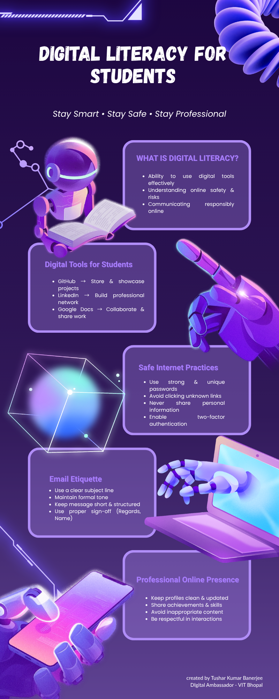
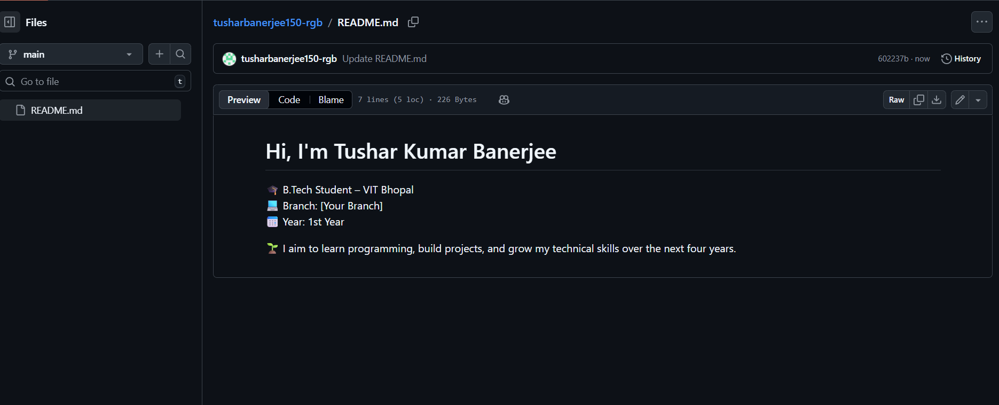
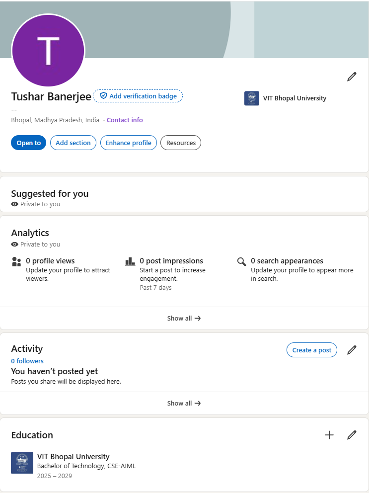
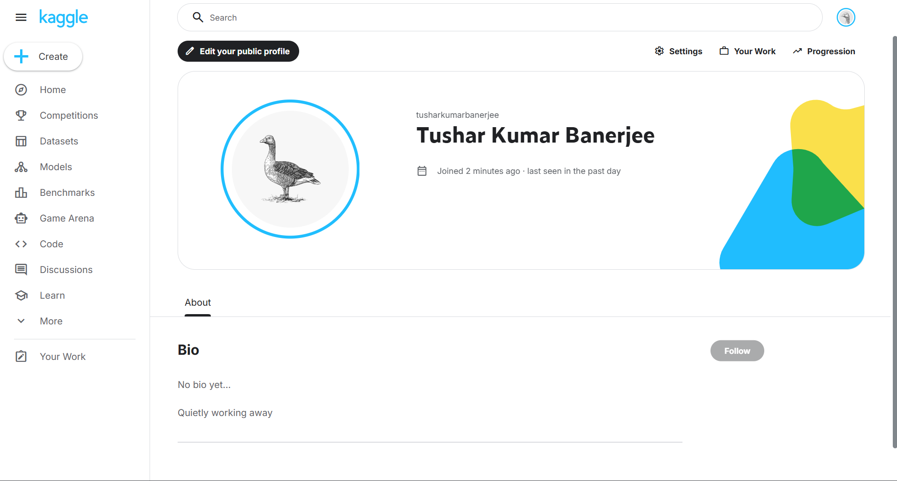
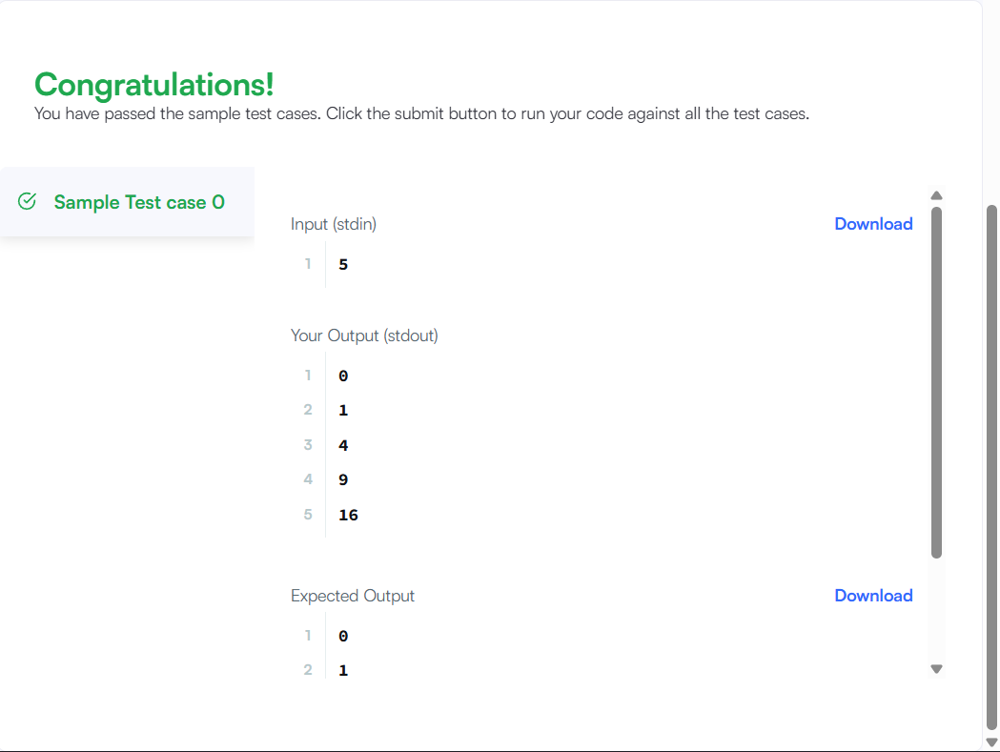

# digital-literacy-project

## Task 1 – Digital Literacy Infographic
I created an infographic using Canva covering digital literacy, safe internet practices, and email etiquette.

## Task 2 – Digital Portfolio
I created my profiles on GitHub, LinkedIn, and Kaggle to build a professional digital presence.
- GitHub: Used to showcase my projects and coding work.
- LinkedIn: Used for professional networking and career opportunities.
- Kaggle: Used to practice data science and problem-solving skills.
### Screenshots:
  
  

## Task 3 – Coding Practice (HackerRank)
I created an account on HackerRank and completed a beginner-level problem to improve my coding skills.
The problem helped me understand basic programming logic and problem-solving techniques. Practising on platforms like HackerRank is useful for building a strong foundation in coding and preparing for technical interviews.
### Screenshot:

### Solution Code:
[View Code](task-3-platforms/hackerrank-code.png)

## Task 3 – Digital Literacy Quiz
[Take the Quiz](https://docs.google.com/forms/d/e/1FAIpQLSeOqZxSdiptd01qie2mGUj1OXzL-_vufyD-PzMGt1LJyWUzZA/viewform?usp=dialog)

## Task 4 – Email Etiquette & Social Media Guidelines
In this task, I drafted two professional emails and created a checklist for responsible social media usage.
- Email 1: Requesting an assignment deadline extension from a professor.
- Email 2: Expressing interest in a summer internship opportunity.
These emails follow proper structure, including a clear subject line, professional tone, and appropriate sign-off.
I also created a "Do’s and Don’ts" checklist for social media to promote responsible and safe online behavior among students.
### Files:
- [Emails](task-4-email-etiquette/emails.txt)
- [Social Media Checklist](task-4-email-etiquette/social-media-checklist.txt)

## Task 5 – Cybercrime Awareness
In this task, I explored the concept of cybercrime by studying a phishing attack scenario. The case study explains how attackers use fake emails and websites to trick users into revealing sensitive information such as passwords and bank details.
I also created a "Stay Safe Online" checklist that provides practical tips to prevent such cyber threats. These include using strong passwords, enabling two-factor authentication, avoiding suspicious links, and following safe online payment practices.
This task helped me understand the importance of cybersecurity awareness and how simple precautions can protect individuals from serious online risks.
### Files:
- [Case Study](task-5-cybercrime/casestudy.txt)
- [Prevention Checklist](task-5-cybercrime/prevention-checklist.txt)
